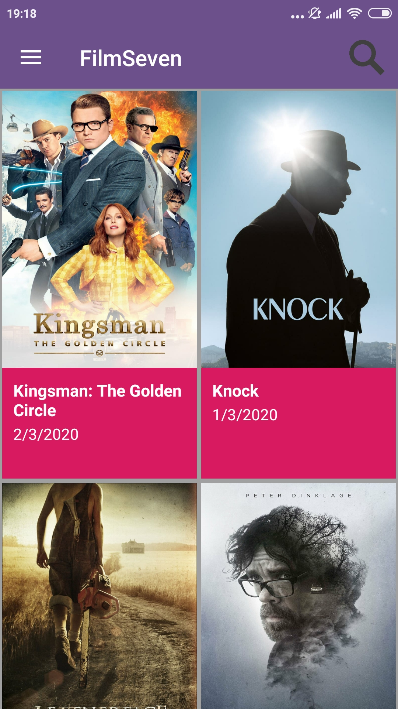
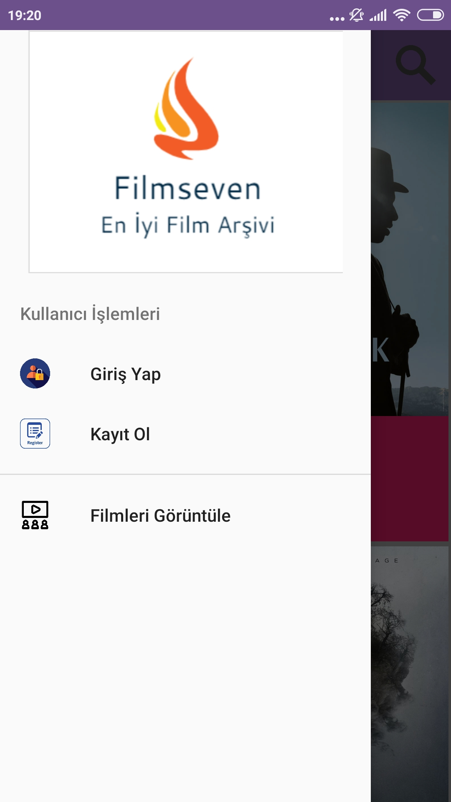
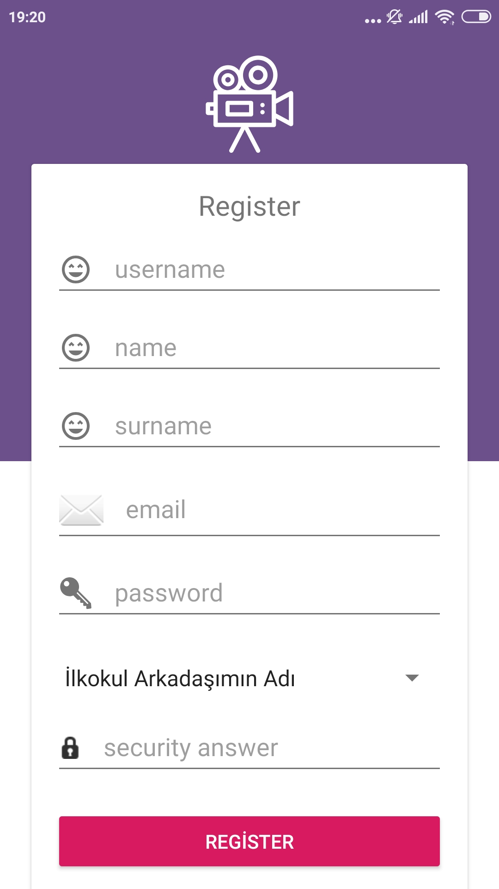
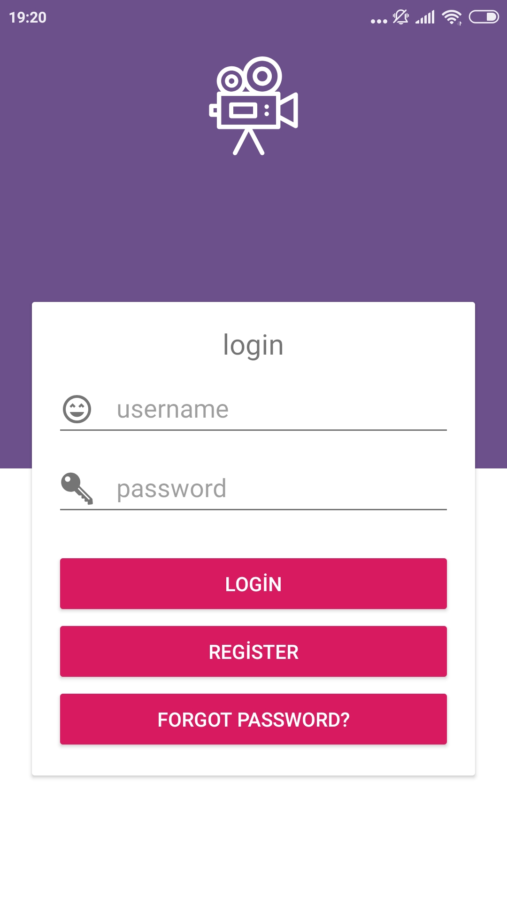

# BMB306- Yazılım Mühendisliği FilmSeven Mobil Film Arşiv Uygulaması

Filmseven mobil arşiv uygulaması sayesinde vizyondaki filmlerin takibi sağlandı.
```
Kullanılan Programlar 
Android Studio

```


# Program Kullanımı
* Programın ilk açılışında Uygulamada Bulunan Güncel Filmlerin Listesi Gözükür. 
*  

* Sol Tarafta bulunan Menüden Kullanıcı Kayıt İşlemi Gerçekleştirilir.
*  
*  
* Kayıt İşlemi Gerçekleştirildikten Sonra Kullanıcı Giriş Ekranından  Giriş Yapabilir.
*  
* Bu Menüden istenilen Ajans seçilerek o ajansa ait güncel desteklerin listelenmesi sağlanır.
*  
* Listelenen desteklerden birine tıklanıldığında ise WebView içerisinde tıklanılan destek programı gösterilir.
*  
*  
*  
* Arama Çubuğunda ise en çok aranan verilere göre düzenlenen bir arama listesi kullanılmıştır
*  

# Emeği Geçenler
* UĞUR ILGIN
* Emre Şahin
* Gizem Nihal Boyraz
* Şeyda Koçak
* Vildan Öt
* Muhammed Erdem Anaçoğlu
* Burak Arslan

