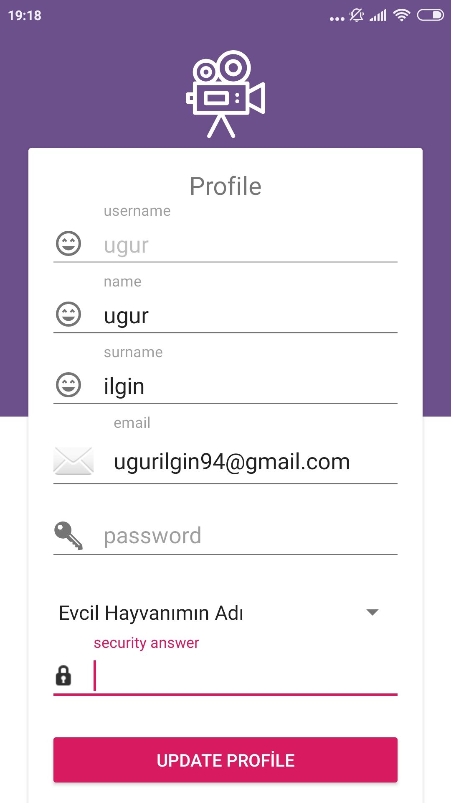
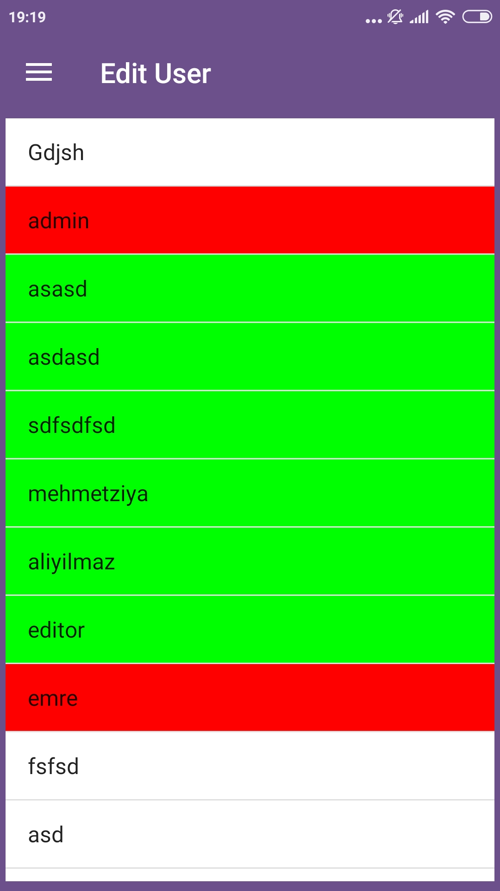

# BMB306- Yazılım Mühendisliği FilmSeven Mobil Film Arşiv Uygulaması

Filmseven mobil arşiv uygulaması sayesinde vizyondaki filmlerin takibi sağlandı.
```
Kullanılan Programlar 
Android Studio

```


# Program Kullanımı
* Programın ilk açılışında Uygulamada Bulunan Güncel Filmlerin Listesi Gözükür. 
*  

* Sol Tarafta bulunan Menüden Kullanıcı Kayıt İşlemi Gerçekleştirilir.
*  
  
* Kayıt İşlemi Gerçekleştirildikten Sonra Kullanıcı Giriş Ekranından  Giriş Yapabilir.
*  
* Eğer Kullanıcı Şifresini Unuttuysa Şifremi Unuttum Menüsüyle Şifresini Yeniliyebilir.
*  
 
* Programa Giriş Yapıldıktan Sonra Sol Taraftaki Menü Butonları Değiştirilir.Ve Kullanıcının Yetkisi Dahilinde Sayfalara Giriş Yapılmasını Sağlar
*  
* Kullanıcı Yetkisine göre Film Ekleyip Güncelleyebilir Filmleri Kaldırabilir.(Eğer Sadece Kullanıcı İse Kendi Filmlerini ve Kendi Profilini, Editör İse Kendi Kategorisindeki Filmleri ve Kendi Kategorisindeki Kullanıcıları,Admin ise Tüm Filmleri ve Kullanıcıları Düzenleyebilir.)
  
  
  
  
  
  
  
  
  

# Emeği Geçenler
* UĞUR ILGIN
* Emre Şahin
* Gizem Nihal Boyraz
* Şeyda Koçak
* Vildan Öt
* Muhammed Erdem Anaçoğlu
* Burak Arslan

